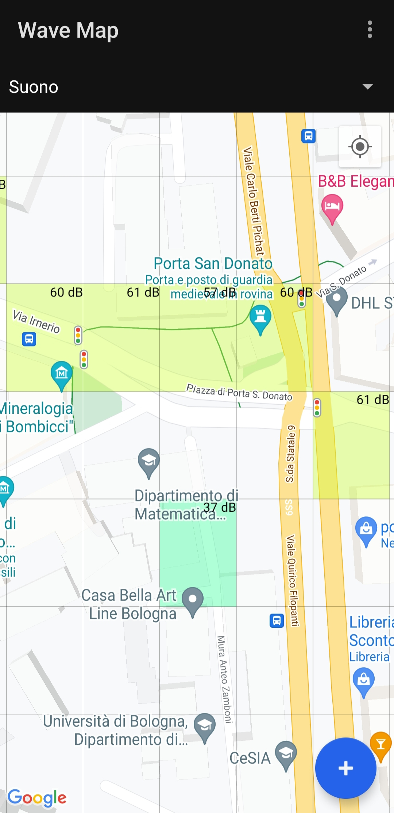

# Wave Map

## Introduction
Project for the Mobile Applications Laboratory course at the University of Bologna (A.Y. 2022-2023).

## Description
Wave Map is an Android application to measure and display in a map the strength of signals (Wi-Fi, LTE, Bluetooth) and noise level.

<div align="center">

</div>

## Compiling
Android Studio is advised to compile the project.

Once imported, a Google Maps API key is required. Insert the key in the `local.properties` file:
```
...
MAPS_API_KEY=my-key-here
...
```
